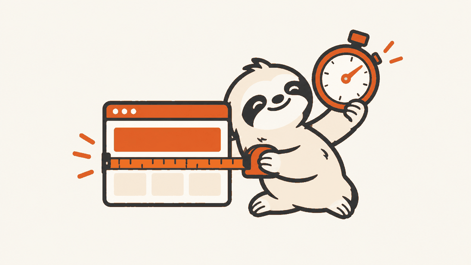
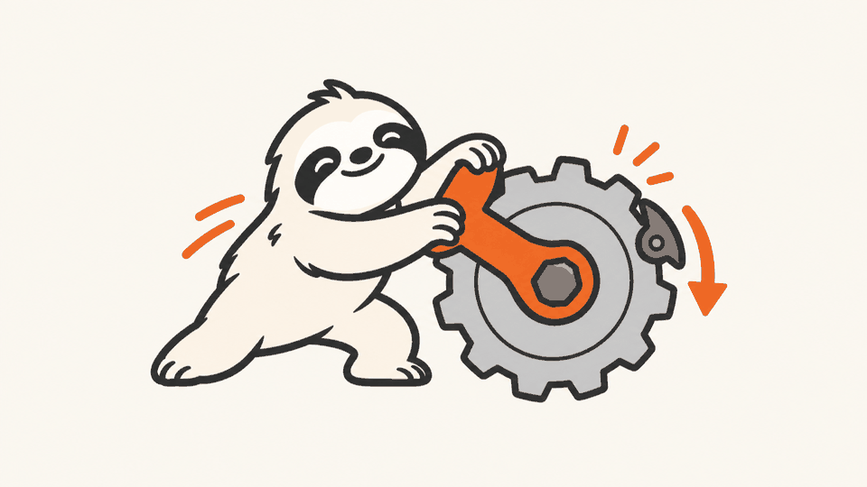
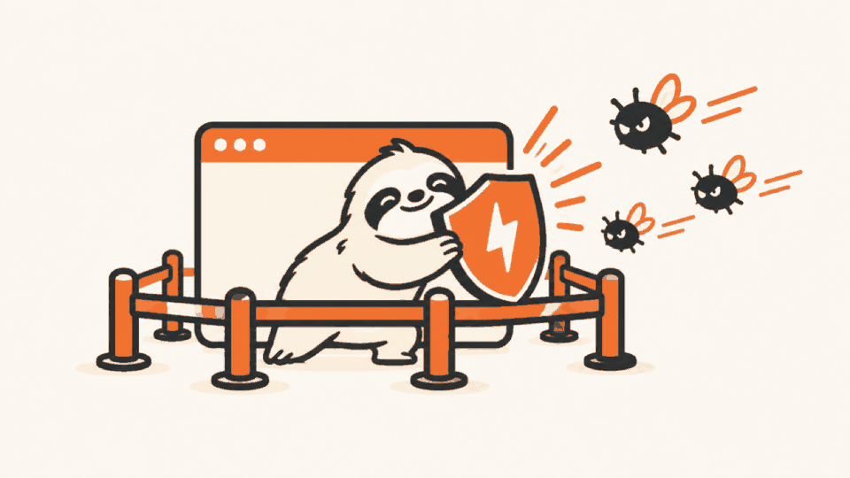

<div align="center">


# 闪电.skill · huashu-flash

**只要 Claude 能把一件事量出来，它就能把这件事变快。**

《疯狂动物城》车管所里那只树懒，名字叫「闪电」。你的网站可能也是。

[](LICENSE)
[](https://skills.sh)

```
npx skills add alchaincyf/huashu-flash
```

或者把这个仓库链接丢给你在用的 Claude Code / Codex，说一句「帮我安装这个 skill」。

</div>

---

## 它是做什么的

把 Anthropic 2026 年 9 月那篇工程博客《[How we made claude.ai 3x faster in two weeks](https://claude.dev/blog/how-we-made-claude-ai-faster/)》里的方法，拆成 agent 能照着执行的八个步骤，用来给你自己的网站提速：

1. 写开工简报：哪几个页面最重要，什么叫「能用」，哪些东西不许动
2. 定义「打开到能用」：骨架屏和占位不算能用
3. 测基线：实验室（冷缓存、Fast 4G、10 次取 p75）加线上真实用户数据
4. 先建棘轮和护栏，再动代码：黄金测试、视觉回归、功能冒烟、SEO 字段一致
5. 找能数的指标，并证明它跟用户体感挂钩
6. 爬山循环：一个改动一个 commit，没变快就回退
7. 胆子、品味、方向，这三件事交给人
8. 最终对比必须配对测（两个版本交替跑），上线由你批准

## 闪电怎么干活

<table>
<tr>
<td width="50%"><br/><b>1. 把网站交给闪电</b><br/>告诉它哪几个页面最重要、什么叫「能用」</td>
<td width="50%"><br/><b>2. 先量</b><br/>冷缓存、限速、测 10 次取 p75，拆开首屏时间花在哪</td>
</tr>
<tr>
<td><br/><b>3. 爬山</b><br/>找能数的指标，先证明它跟体感挂钩，再一步步往下压</td>
<td><br/><b>4. 拧紧棘轮</b><br/>赢下来的写进基准，只许变好不许变差</td>
</tr>
<tr>
<td><br/><b>5. 守住护栏</b><br/>黄金测试、视觉回归、功能冒烟、SEO 字段一个都不许变</td>
<td><br/><b>6. 交差</b><br/>新旧版本交替配对测量，确认真的变快，你批准后上线</td>
</tr>
</table>

附带两个脚本：`scripts/bench.py`（冷缓存下测「打开到能用」，支持网络与 CPU 限速、真打一个字确认能输入、A/B 交替配对）和 `scripts/ratchet.py`（测出来的数只许降不许升）。

## 实战：我们拿它给自己的 4 个网站提速

2026 年 9 月，四个 agent 各拿这套方法给一个网站提速，全部上线。数字都是实验室配对测量（Fast 4G 对所有请求限速、冷缓存、优化前后交替各 10 次）的 p75：

| 网站 | 核心操作 | 优化前 | 优化后 | 降幅 | 主要做了什么 |
|---|---|---|---|---|---|
| 公众号排版器 | 打开到能打字 | 2238ms | 209ms | **−90.7%** | 静态外壳（原文招式）、库同源托管、用不到的库按需加载 |
| 公众号排版器 | 打开到预览能用 | 2238ms | 1037ms | −53.7% | 同上 |
| bookai.top 教程页 | 打开到能用 | 7776ms | 1588ms | **−79.6%** | 首屏大图按显示尺寸重编码、去掉 400KB 全站图标脚本 |
| img2046.com 压缩工具 | 打开到能用 | 1007ms | 895ms | −11% | 批量下载才用的库按需加载，脚本执行 −29% |
| huasheng.ai 首页 | LCP | 716ms | 620ms | −13.4% | 首屏大图换 WebP |

不是每个站都能快 10 倍。首屏被一个大阻塞卡住的站（排版器的 5 个外部同步脚本、教程页的 2400 像素原图）收益最大；已经优化过的站，剩下的空间多半在网络和 CDN 配置上。

过程中踩过、已经写进 skill 的坑：

- 从自己电脑量线上，所有网站的首字节时间都在 1.4 秒上下，连 vercel.com 也是，原因是测量机走了代理。所以量线上之前先量一个对照站。
- 托管平台的在线图片转换有免费额度，超了新图片直接报错。能在构建时预先生成的，就预先生成。
- 静态外壳要先填好用户存过的草稿，否则用户会以为是新页面直接粘贴，旧草稿随后被自动保存覆盖。
- 机器上有多个任务同时在跑时，分开时段测的前后对比不可信，最终对比要交替配对测。

## 目录

```
huashu-flash/
├── SKILL.md                         # 八个步骤、测量纪律、「别这样」清单
├── assets/                          # 闪电吉祥物与流程插图
├── references/
│   ├── measurement-protocol.md      # 测量口径、CrUX、首屏拆解、确定性计数
│   ├── playbook.md                  # 招式库，每招标注出处（原文／通用／实测）
│   └── brief-template.md            # 开工简报模板
└── scripts/
    ├── bench.py                     # 测速（pip install playwright）
    └── ratchet.py                   # 棘轮
```

## 关于作者

| | |
|:---|:---|
| 🌐 官网 | [bookai.top](https://bookai.top) · [huasheng.ai](https://www.huasheng.ai) |
| 𝕏 Twitter | [@AlchainHust](https://x.com/AlchainHust) |
| 📺 B站 | [花叔v](https://space.bilibili.com/14097567) |
| ▶️ YouTube | [@Alchain](https://www.youtube.com/@Alchain) |
| 📕 小红书 | [花叔](https://www.xiaohongshu.com/user/profile/5abc6f17e8ac2b109179dfdf) |
| 💬 公众号 | 微信搜「花叔」 |

## 许可证

MIT。随便用，随便改，随便造。

---

<div align="center">

**[女娲](https://github.com/alchaincyf/nuwa-skill)** 造 Skill。**[达尔文](https://github.com/alchaincyf/darwin-skill)** 让 Skill 进化。**闪电** 让你的网站变快。

MIT License © [花叔 Huashu](https://github.com/alchaincyf)

</div>

---

<div align="center">
<sub>作者的其他项目 · also by 花叔</sub>

[](https://github.com/alchaincyf/fanbox)

</div>

---

## English

**huashu-flash** turns the method from Anthropic's engineering post *[How we made claude.ai 3x faster in two weeks](https://claude.dev/blog/how-we-made-claude-ai-faster/)* into an agent skill for speeding up your own website: define what "usable" means, measure a baseline (cold cache, Fast 4G, p75 of 10 runs), build ratchets and guardrails before touching code (golden tests, visual regression, smoke tests, SEO parity), find deterministic proxy metrics and prove they track real latency, hill-climb one commit at a time, and report with interleaved A/B paired measurements. Humans keep ambition, taste and direction; deploys need your approval.

Field results on four real sites (lab, paired A/B, p75): a Markdown editor went from 2238ms to 209ms to first keystroke (−90.7%); a tutorial page from 7776ms to 1588ms (−79.6%); two already-optimized sites improved 11–13%. Not every site can get 10x faster, and the skill says so.

Install: `npx skills add alchaincyf/huashu-flash`. The skill content is in Chinese. MIT licensed.
